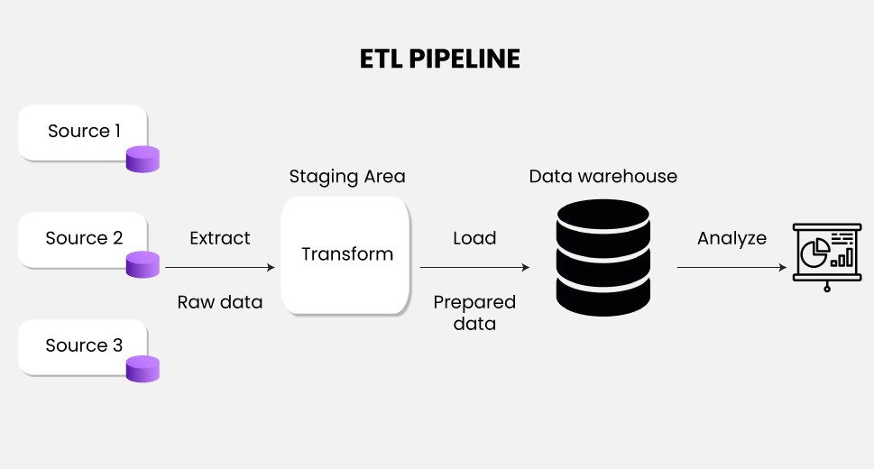

# 🚀 CodTech Data Science Internship – Complete Task Repository

Welcome to my official project repository for the **Data Science Internship** at **CodTech IT Solutions**.
This repository documents my hands-on learning experience and practical work during the internship period, covering key domains such as:

* ✅ ETL (Extract, Transform, Load) Processes
* ✅ Deep Learning using CNN
* ✅ End-to-End Machine Learning with Deployment
* ✅ Mathematical Optimization with Python

---

## 👨‍💻 About Me

I'm **Ujjwal Tyagi**, a BCA student passionate about leveraging data to generate insights and drive decisions. Through this internship, I strengthened my foundation in data preprocessing, model building, and deployment, along with industry-relevant problem-solving skills.

---

## 🧠 Internship Objective

The goal of this internship was to apply theoretical data science concepts to **real-world tasks** and improve my technical abilities through practical assignments using Python and popular libraries. Each task was designed to simulate a professional data science workflow from data collection to deployment.

---

## 📁 Repository Structure

```plaintext
Codtech-Data-Science-Internship-Tasks/
│
├── Task1_ETL/
│   └── etl_script.py
│   └── Iris.csv
│   └── Readme.md
│
├── Task2_DL/
│   ├── image_classification_cnn.ipynb
│   └── dataset/
│
├── Task3_Deployment/
│   ├── streamlit_app.py
│   ├── model.pkl
│   └── requirements.txt
│
├── Task4_Optimization/
│   └── optimization_model.py
│
├── Screenshots/
│   ├── Task1_Process.jpg
│   ├── task2_accuracy.png
│   └── ...
│
├── .gitignore
└── LICENSE
└── README.md
```

---

## 📌 Tasks Overview

### 📦 Task 1: ETL Pipeline

* **Objective**: Automate data extraction from a CSV, transform it for analysis, and load it into a structured format.
* **Skills Applied**:

  * Data cleaning and manipulation using Pandas
  * Null handling, formatting, and filtering
  * Exporting transformed data to new CSV
* **Tools**: Python, Pandas
* **Output**: Transformed dataset ready for visualization and modeling

---

### 🤖 Task 2: Deep Learning Model – Image Classification

* **Objective**: Build a CNN (Convolutional Neural Network) model for multi-class image classification.
* **Skills Applied**:

  * Image preprocessing with Keras ImageDataGenerator
  * CNN architecture design
  * Model training, validation, and evaluation
* **Tools**: TensorFlow, Keras, Matplotlib
* **Output**: Trained deep learning model with performance accuracy graphs

---

### 🌐 Task 3: End-to-End ML Project with Deployment

* **Objective**: Develop an ML model from scratch, perform EDA, train and test, and finally deploy using Streamlit.
* **Workflow**:

  * Data Preprocessing
  * Exploratory Data Analysis (EDA)
  * Model Training & Evaluation
  * Save model using Pickle
  * Deploy with a simple and responsive Streamlit interface
* **Tools**: Scikit-learn, Pandas, Seaborn, Streamlit
* **Output**: A live web app where users can input values and get predictions in real time

---

### 📊 Task 4: Optimization Model

* **Objective**: Solve a real-world business case using Linear Programming
* **Problem Example**: Maximize profit or minimize cost with constraints (e.g., production planning, transport optimization)
* **Skills Applied**:

  * Defining decision variables
  * Formulating objective functions and constraints
  * Solving using PuLP
* **Tools**: Python, PuLP
* **Output**: Optimal solution for the given problem with interpretation

---

## 🖼 Screenshots

| Task                   | Screenshot                           |
| ---------------------- | ------------------------------------ |
| ETL Pipeline           |     |
| Deep Learning Accuracy |   |
| Streamlit App          |  |
| Optimization Results   |     |

---

## 🧰 Tools & Technologies Used

| Category         | Tools & Libraries   |
| ---------------- | ------------------- |
| Programming      | Python              |
| Data Wrangling   | Pandas, NumPy       |
| Visualization    | Matplotlib, Seaborn |
| Machine Learning | Scikit-learn        |
| Deep Learning    | TensorFlow, Keras   |
| Optimization     | PuLP                |
| Web Deployment   | Streamlit           |
| IDE              | Visual Studio Code  |
| Version Control  | Git & GitHub        |

---

## 💡 Key Learnings & Outcomes

* Gained confidence in **working with structured and unstructured data**
* Built and deployed a **real-time machine learning application**
* Understood **deep learning fundamentals** by building CNNs
* Learned to **formulate and solve optimization problems**
* Experienced the importance of **code versioning and documentation**

---

## 📦 How to Run the Project Locally

### ✅ Clone the Repository

```bash
git clone https://github.com/ujjwaltyagi03/codtech-data-science-internship.git
cd codtech-data-science-internship
```

### ✅ Set Up Virtual Environment (Optional but Recommended)

```bash
python -m venv env
source env/bin/activate      # On Windows: env\Scripts\activate
```

### ✅ Install Required Libraries

```bash
pip install -r requirements.txt
```

### ✅ Navigate to Task and Run

```bash
cd task3-end-to-end-ml
streamlit run streamlit_app.py
```

---

## 📜 License

This repository is licensed under the [MIT License](LICENSE).
Feel free to explore, use, or extend the code by providing proper attribution.

---

## 🤛 Connect with Me

I'm always open to collaboration, opportunities, or feedback.
Let’s connect and grow together in the world of data science!

* 📧 Email: [ujjwalt0316@gmail.com](mailto:ujjwalt0316@gmail.com)
* 💼 [LinkedIn](https://www.linkedin.com/in/ujjwal-tyagi0316)

---

> *“Every dataset tells a story – you just need the right tools to listen.”*
